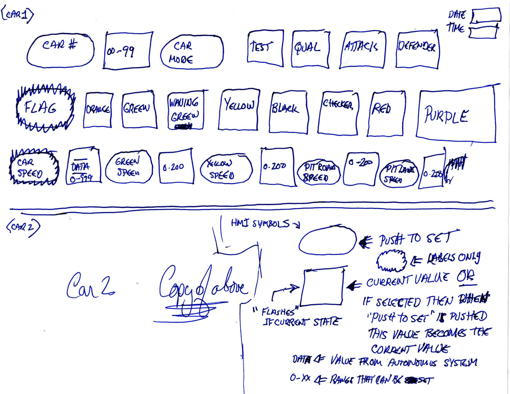
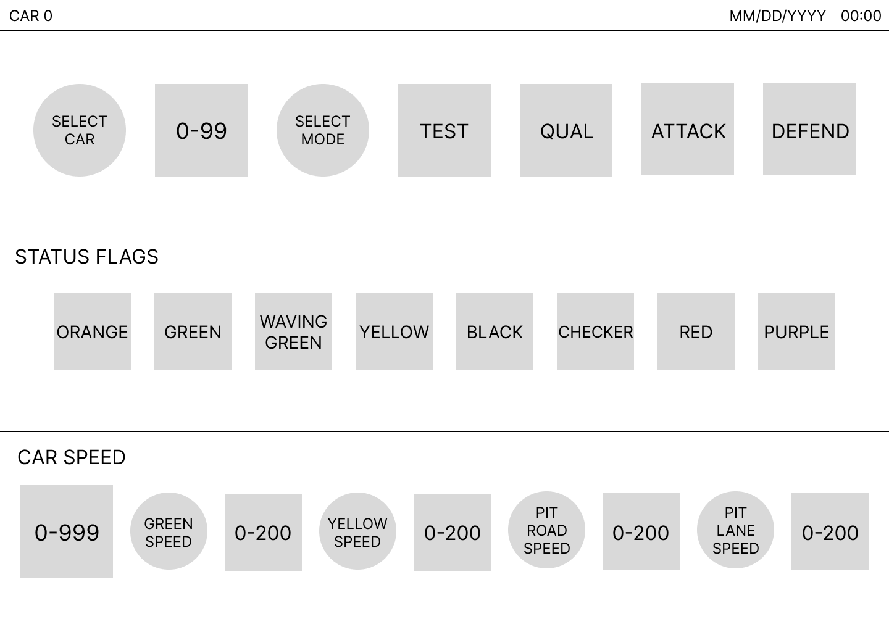
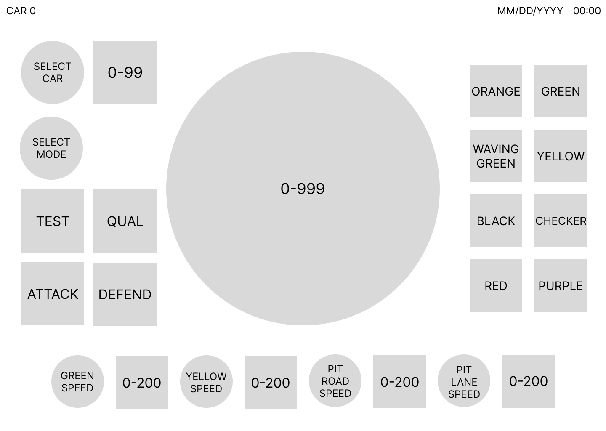
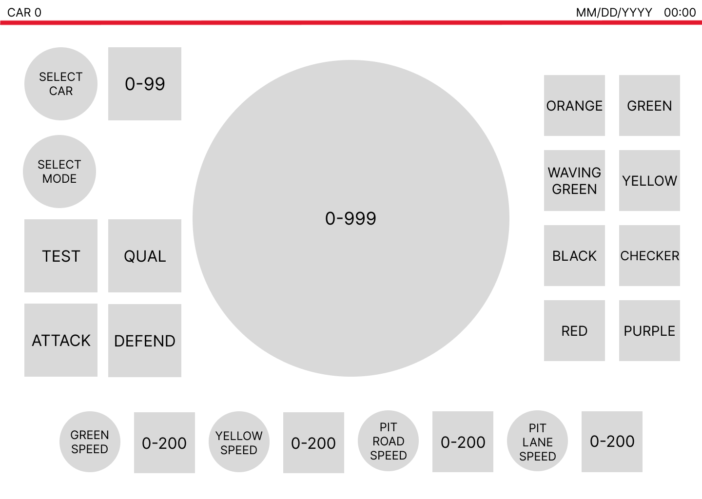
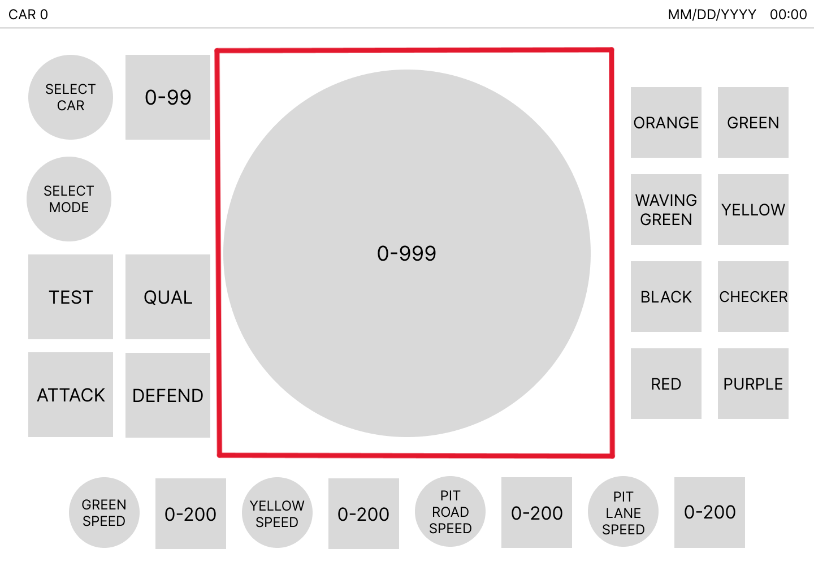
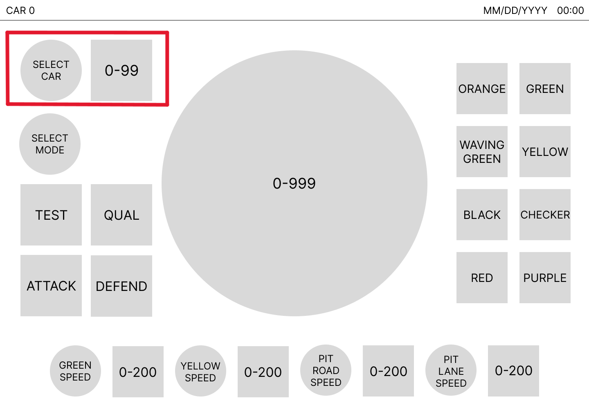
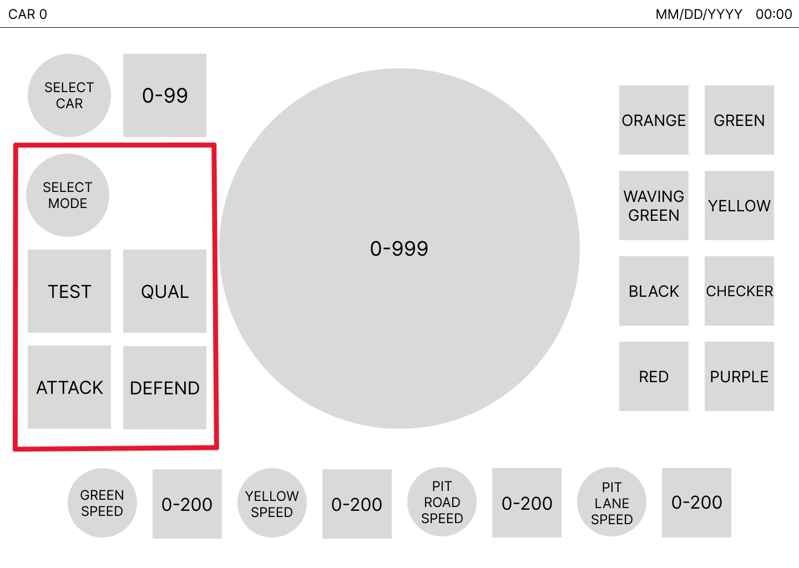
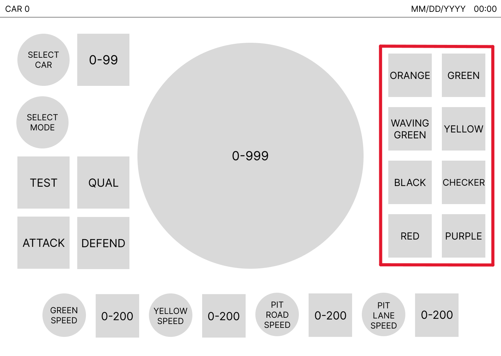
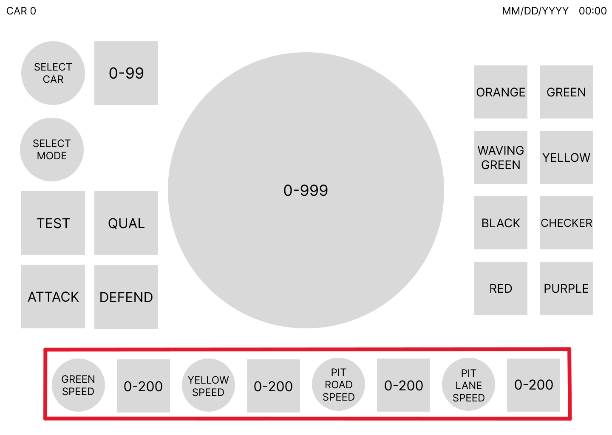
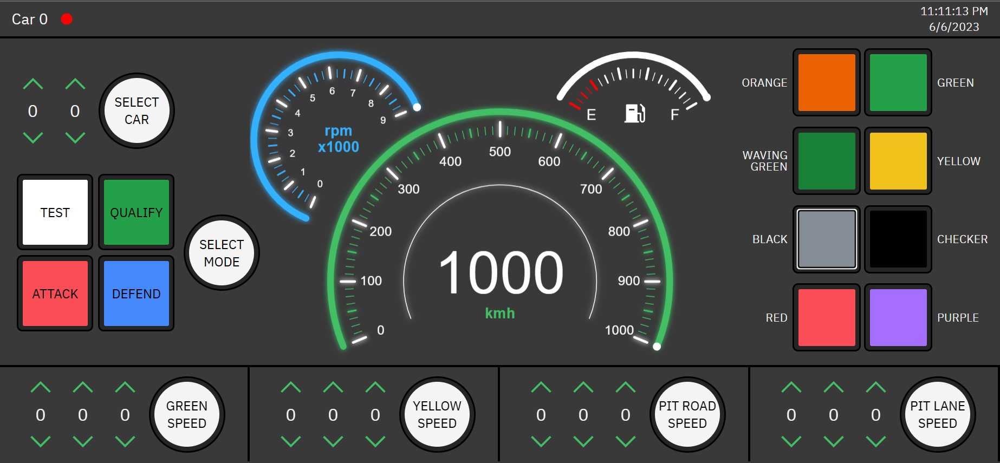

# Design

## Initial Design

The initial design of the HMI is shown below:

and after translation to Figma:

Circles are set buttons, and when toggled they set their associated value. For example, when the `SELECT CAR` set button is toggled, the currently selected car number is set as the current value. A set button is active (the value is set) when it lights up green. 

Squares with numbers inside display the current value. In the case of flags (second row), each square represents a flag and can be toggled. When a flag is active it will light up. In the case of modes (first row to the right), each square represents a mode and can be toggled. 

Car modes are mutually exclusive and only one can be active at a time (unlike flags which can be active simultaneously). To set a car mode, first make sure the `SELECT MODE` set button is not active and then select the desired mode. Once a mode is selected, toggle the `SELECT MODE` set button to set the mode.

For all set buttons, once a set button is active the associated value cannot be changed. For example, once a car mode is set, the mode buttons become disabled and cannot be clicked. Only once the set button is toggled to inactive can the associated value be changed again.

## Final Design

The simple layout of the initial design made it somewhat unintuitive, which prompted a redesign to the one shown below:

The final design still contains all the components of the initial design, just in a different layout. The design can be divided into separate components:

- Info bar: displays the currently connect car and the date/time

- Gauges: contains various gauges displaying data from the car

- Car selector: used to select which car to connect to

- Mode selector: used to select the current mode

- Flag selector: used to set active status flags

- Speed selectors: used to set different speeds for the car

The final design translated to a web app looks like:

The web app contains a few more features than the final design above:
- Status indicator: a small dot next to the car number in the info bar that displays the current status of the HMI. Green if connected to a car and red otherwise.
- Gauges: the web app also includes a tachometer (blue gauge) and fuel meter (white gauge) to display additional information besides just speed.

## Functionality

Since the HMI is currently only a frontend template not connected to any backend, it is difficult to see it at work. However, to view a short demo of the gauges displaying different values, set any car number by pressing on `SELECT CAR`. This will trigger the HMI to "connect" to a vehicle and the gauges will update to simulate data coming in.
